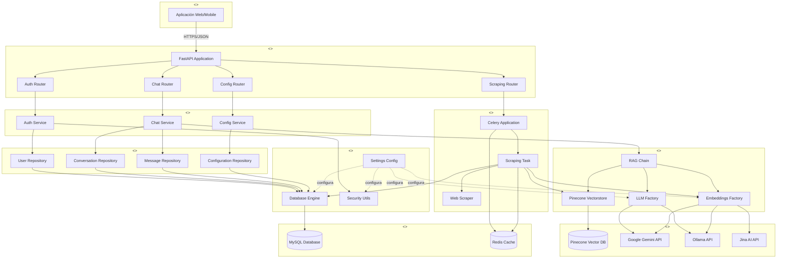
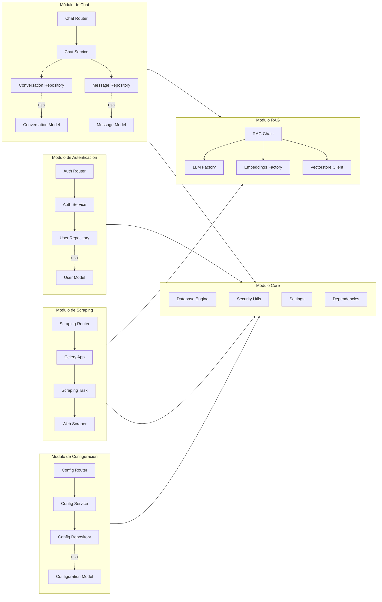
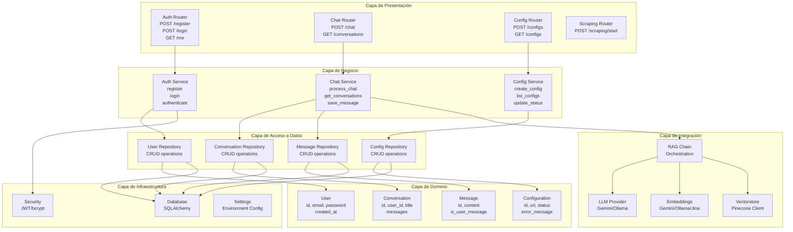
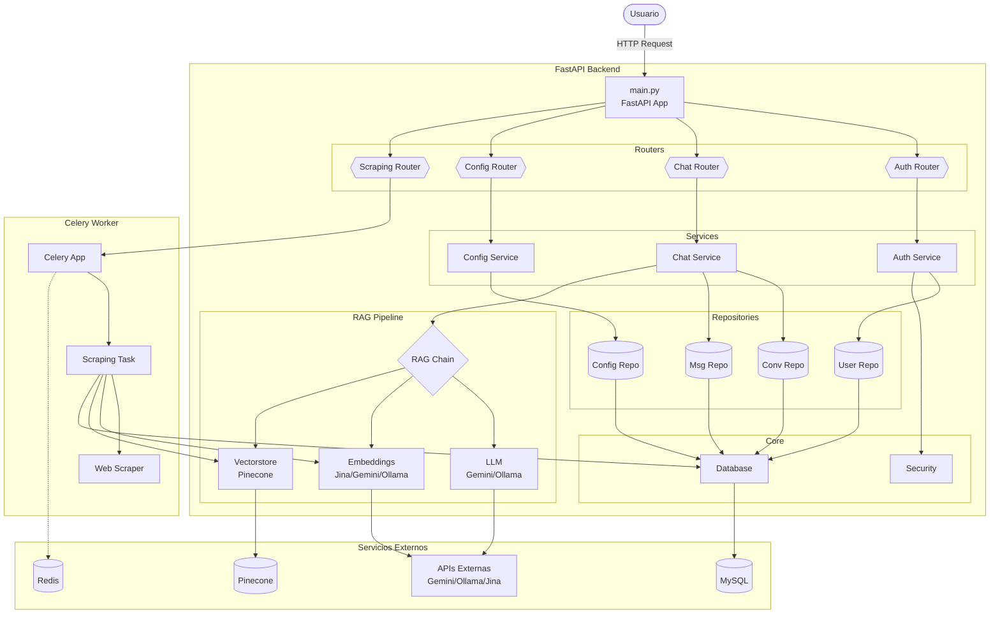
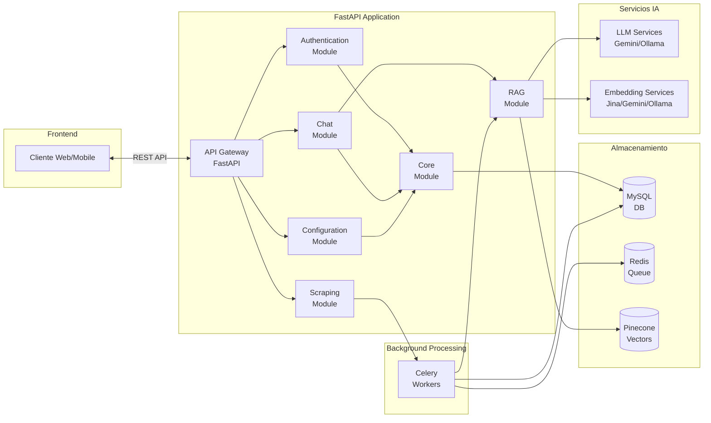

# Diagramas de Componentes - ChatBotRAG Backend

## Diagrama de Arquitectura General

---

## Diagrama de Módulos

---

## Diagrama de Capas

---

## Diagrama Detallado de Componentes

---

## Diagrama de Alto Nivel

---

## Descripción de Componentes

### API Layer
- **FastAPI Application**: Punto de entrada principal, maneja CORS y middleware
- **Auth Router**: Endpoints de autenticación (/register, /login, /refresh)
- **Chat Router**: Endpoints de chat (/chat, /conversations)
- **Config Router**: Endpoints de configuración (/configs)
- **Scraping Router**: Endpoints de scraping (/scraping/start)

### Service Layer
- **Auth Service**: Lógica de negocio para autenticación y manejo de usuarios
- **Chat Service**: Lógica de negocio para chat y gestión de conversaciones
- **Config Service**: Lógica de negocio para configuraciones de scraping

### Repository Layer
- **User Repository**: Acceso a datos de usuarios
- **Conversation Repository**: Acceso a datos de conversaciones
- **Message Repository**: Acceso a datos de mensajes
- **Config Repository**: Acceso a datos de configuraciones

### RAG Components
- **RAG Chain**: Orquestación del pipeline de RAG (Retrieve + Generate)
- **LLM Factory**: Factory para proveedores de LLM (Gemini/Ollama)
- **Embeddings Factory**: Factory para proveedores de embeddings (Jina/Gemini/Ollama)
- **Vectorstore**: Cliente de Pinecone para búsqueda vectorial

### Core Infrastructure
- **Database Engine**: Motor SQLAlchemy con pooling de conexiones
- **Security Utils**: Utilidades de JWT y hashing de contraseñas (bcrypt)
- **Settings**: Configuración de la aplicación via variables de entorno

### Background Workers
- **Celery App**: Aplicación Celery para tareas asíncronas
- **Scraping Task**: Tarea de scraping, embedding y almacenamiento
- **Web Scraper**: Scraper recursivo BFS con chunking de texto

### External Services
- **MySQL**: Base de datos relacional para datos estructurados
- **Redis**: Message broker y backend de resultados para Celery
- **Pinecone**: Base de datos vectorial para búsqueda semántica
- **Gemini/Ollama/Jina**: Proveedores de LLM y embeddings
